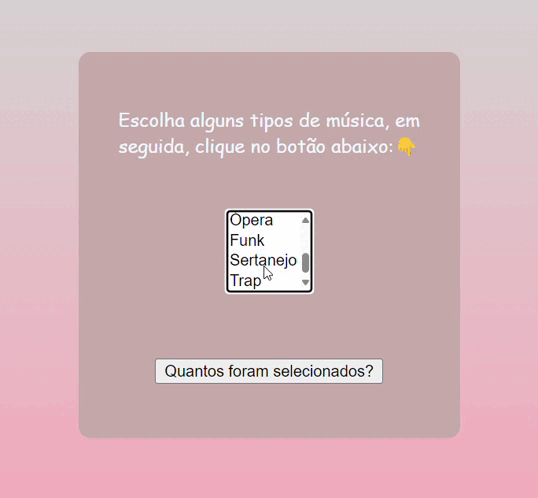

# `Introdução`
* A tarefa tem intuito de reforçar os estudos em sala sobre laços de repetição no javaScript e entender como o projeto escolhido funciona.

# `Descrição`
 * O projeto em questão visa em adicionar três novos estilos musicais ao projeto existente, proporcionando aos usuários uma variedade de opções musicais. Foi utilizado o laço "for" para que o usuário consiga selecionar um ou mais estilos musicais precionando a tecla "ctrl", caso aconteça, apererece um "alert" informando a quantidade de estilos selecionados. Além disso realizamos ajustes estilísticos no CSS para aprimorar sua estética visual.

# `Fontes utilizadas`
* HTML5, CSS3, Js
* [*Link do projeto utilizado*](https://developer.mozilla.org/pt-BR/docs/Web/JavaScript/Guide/Loops_and_iteration)

# `Tecnologias Utilizadas`
* HTML5, CSS3, JavaScript.

# `Autores`
* Maria Eduarda Fontinele De Castro.

# `Projeto`
